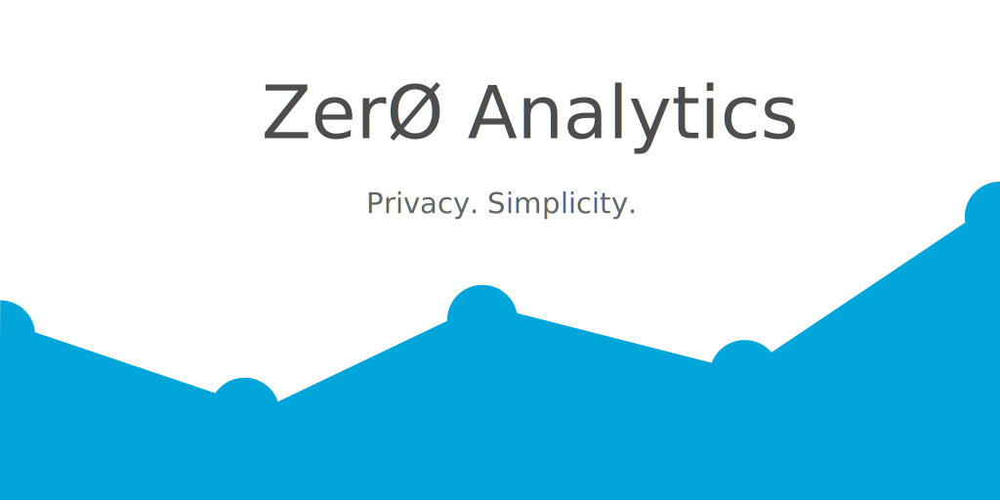
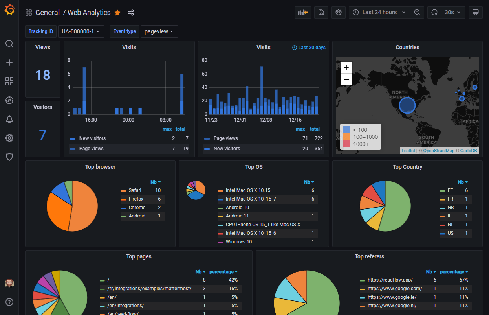
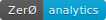

[](https://github.com/ncarlier/za/actions/workflows/build.yml)
[](https://goreportcard.com/report/github.com/ncarlier/za)
[](https://hub.docker.com/r/ncarlier/za/)
[](https://github.com/ncarlier/za)
[](https://www.paypal.me/nunux)

ZerØ Analytics is a Google Analytics alternative with:

- Zero personal data usage
- Zero vendor lock-in
- Zero complexity
- And a googol of love!

## Features

- Single native executable
- Shameful copy of the Google Analytics tag
- Multiple output support ([Loki](loki), [Elasticsearch](elastic), files, ... )
- JSON or templatized output
- Track visited pages, uncaught errors and custom events
- Optional GeoIP support thanks to [DB-IP](https://db-ip.com)
- Customizable beacon image (1px or badge)

Here an example of what you can get using Grafana with Loki:



## Installation

By compiling from sources:

```bash
$ go get -v github.com/ncarlier/za
```

**Or** by downloading the binary regarding your architecture:

```bash
$ curl -sf https://gobinaries.com/ncarlier/za | sh
```

**Or** by using Docker:

```bash
$ docker run -d --name=zero-analytics ncarlier/za
```

## Configuration

The configuration is a TOML file structured like this:

```toml
# ZerØ Analytics configuration file

[global]
## GeoIP database location. GeoIP is disabled if not set.
geo_ip_database = "./var/dbip-country-lite.mmdb"

# Global tags can be specified here in key="value" format.
[global.tags]
  dc = "eu-west-1" # will tag all metrics with dc=eu-west-1
  ## Environment variables can be used as tags, and throughout the config file
  user = "$USER"

# List of trackers
[[trackers]]
## Tracking ID
tracking_id = "UA-XXXX-Y"
## Only HTTP request from this origin will be collected
origin = "http://localhost:8000"
## Badge configuration (<title>|<label>|<color>)
badge = "zero|analytics|#00a5da"

# Outputs configuration
[[outputs.file]]
  ## Files to write to, "stdout" is a specially handled file.
  files = ["stdout"]
  ## Data format to output ("json" or "template")
  data_format = "template"
```

A complete and documented example can be found [here](./etc/zero-analytics.example.toml).

## Outputs

ZerØ Analytics is able to format and write collected events to multiple outputs:

### File

This output is usefull if you want to process events by an external toolchain.

```toml
[[outputs.file]]
  ## Files to write to, "stdout" is a specially handled file.
  files = ["/tmp/events.log"]
```

### HTTP

This output is usefull if you want to process events by an external service.

```toml
[[outputs.http]]
  ## URL is the address to send events to
  url = "http://localhost:8081"
  ## Timeout for HTTP message
  timeout = "2s"
  ## HTTP method, one of: "POST" or "PUT"
  method = "POST"
  ## HTTP Basic Auth credentials
  #  username = "username"
  #  password = "pa$$word"
  ## Compress body request using GZIP
  gzip = true
```

### Loki

*[Loki](https://grafana.com/oss/loki/) is a horizontally-scalable, highly-available, multi-tenant log aggregation system inspired by Prometheus.*

```toml
[[outputs.loki]]
  ## Loki URL
  url = "http://localhost:3100"
  ## Timeout
  timeout = "2s"
  ## Batch size
  batch_size = 10
  ## Batch interval
  batch_interval = "10s"
```

#### Data format

Some outputs are able to send formated events.
This is the case for `Loki`, `HTTP`, and `File`.
By default they format the event data  as `JSON`:

```json
{
  "tid": "UA-XXXX-Y",
  "browser":"Chrome",
  "os":"Linux x86_64",
  "tags": {"dc":"eu-west-1","user":"nicolas"},
  "timestamp": "2020-09-27T22:01:58.623366267Z",
  "language": "en-US",
  "hostname": "http://localhost",
  "path": "/classic.html",
  "referer": ""
}
```

You can also format data as a string by using [Go Template](https://golang.org/pkg/text/template/).
By default the template is the [Common Log Format](https://en.wikipedia.org/wiki/Common_Log_Format).

Add this to your output configuration in order to specify data format:

```toml
  ## Data format to output ("json" or "template")
  data_format = "template"
  ## Go template used by the template data format. By defaut "Common Log Format".
  data_format_template = "{{.ClientIP}} {{.HostName}} - [{{.FormattedTS}}] \"GET {{.DocumentPath}} {{.Protocol}}\" 200 1 \"{{.DocumentReferer}}\" \"{{.UserAgent}}\""
```

## Add ZerØ Analytics to your site

To start tracking pageviews, copy the following tracking snippet to all pages of the website you want to track.

```html
<!-- Zero Analytics script -->
<script>
  (function(i, s, o, g, r, a, m){
    s[r]=s[r]||function(){
      (s[r].q=s[r].q||[]).push(arguments)
    };
    a=i.createElement(o),
    m=i.getElementsByTagName(o)[0];
    a.async=1; a.src=g; a.id='za-script';
    m.parentNode.insertBefore(a,m)
  })(document, window, 'script', 'http://localhost:8080/za.js', 'za');
  za('create', 'UA-XXXX-Y', 'auto');
  za('send', 'pageview');
</script>
<!-- End Zero Analytics script -->
```

### Alternative async snippet

While the snippet described before ensures the script will be loaded and executed asynchronously on all browsers,
it has the disadvantage of not allowing modern browsers to preload the script.

This alternative async snippet adds support for preloading:

```html
<!-- Zero Analytics script -->
<script>
  window.za = window.za||function(){(za.q=za.q||[]).push(arguments)};za.l=+new Date;
  za('create', 'UA-XXXX-Y', 'auto');
  za('send', 'pageview');
</script>
<script async src='http://localhost:8080/za.js' id="za-script"></script>
<!-- End Zero Analytics script -->
```

### Tracked event types

The analytics script is able to track 3 kinds of events: **page views**, **errors** and **custom events**:

#### Page views

```html
<!-- Zero Analytics script -->
<script>
  ...
  za('send', 'pageview');
</script>
<!-- End Zero Analytics script -->
```

As soon the page is loaded, the analytics script will send page hit to the collector endpoint.

#### Errors

```html
<!-- Zero Analytics script -->
<script>
  ...
  za('send', 'error');
</script>
<!-- End Zero Analytics script -->
```

As soon a uncaught error is thrown, the analytics script will catch and send the error to the collector endpoint.

#### Custom events

```js
// Somewhere in your site
za('send', 'event', {"foo": "bar"});
```

The analytics script will send the event payload to the collector endpoint.

## Badge

ZerØ Analytics is able to create tracked badges, which can easily be included in GitHub readmes or any other web page.

By default the badge will be: 

You can customize the badge using the tracker section configuration.

Then you can insert the badge into your web page:

```html
<!-- Somewere in your site -->

```

Note that a badge hit will produce a [custom event](#custom-events). This means that you are able to send a JSON base64 encode payload by using query parameters:

```html
<!-- Somewere in your site -->

```

***

## License

ZerØ Analytics is provided under the [GNU Affero General Public License Version 3 (AGPLv3)](https://github.com/ncarlier/za/blob/master/LICENSE).

```text
ZerØ Analytics is a Google Analytics alternative focused on privacy and simplicity.

Copyright (C) 2020 Nicolas Carlier

This program is free software: you can redistribute it and/or modify
it under the terms of the GNU Affero General Public License as
published by the Free Software Foundation, either version 3 of the
License, or (at your option) any later version.

This program is distributed in the hope that it will be useful,
but WITHOUT ANY WARRANTY; without even the implied warranty of
MERCHANTABILITY or FITNESS FOR A PARTICULAR PURPOSE. See the
GNU Affero General Public License for more details.

You should have received a copy of the GNU Affero General Public License
along with this program.  If not, see <https://www.gnu.org/licenses/>
```

---

[loki]: https://grafana.com/oss/loki/
[elastic]: https://www.elastic.co/
